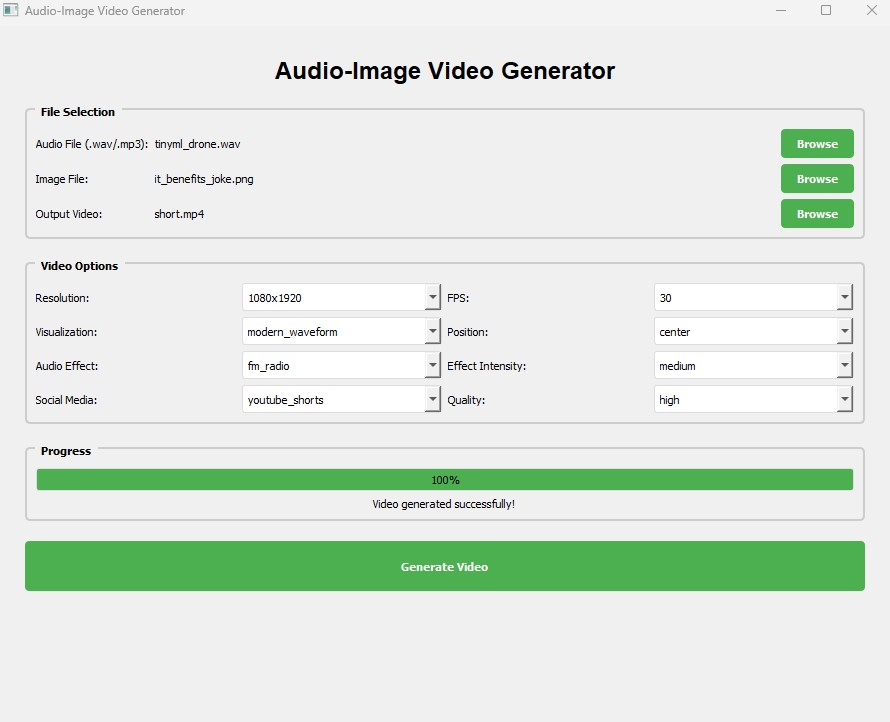

# 🎵 AudioViz Pro - Professional Audio Video Generator

[](https://python.org)
[](https://www.qt.io/)
[](LICENSE)
[](https://github.com/alihayajneh/Audio-Video-Generator)

> Transform your audio files into stunning visualized videos with professional-grade effects and social media optimization.



## ✨ Features

### 🎨 **6 Beautiful Visualizations**
- **Modern Waveform** - Smooth gradient waveforms with glow effects
- **Glow Bars** - Rainbow frequency bars with logarithmic spacing
- **Circular Bars** - 360° mandala-style frequency visualization
- **Spectrum Wave** - Flowing wave patterns based on frequency analysis
- **Particle Wave** - Dynamic floating particles responding to audio
- **Neon Bars** - Cyberpunk-style electric bars with bright cores

### 🎙️ **Vintage Audio Effects**
- **FM Radio** - Clean radio sound with subtle compression
- **AM Radio** - Classic radio with static and bandwidth limiting
- **Vintage FM** - Warm retro sound with wow & flutter
- **Lo-Fi AM** - Heavy vintage processing with vinyl crackle

### 📱 **Social Media Ready**
- **Instagram Post** (1080x1080) - Square format optimization
- **Instagram Story** (1080x1920) - Vertical 9:16 aspect ratio
- **TikTok** (1080x1920) - Mobile-first encoding
- **YouTube Shorts** (1080x1920) - High-quality vertical videos
- **Facebook & Twitter** (1280x720) - Web-optimized encoding

### ⚙️ **Professional Features**
- Memory-efficient frame-by-frame processing
- FFmpeg integration for professional encoding
- Multiple quality presets (High/Medium/Fast)
- Real-time progress tracking
- Cross-platform compatibility

## 🚀 Quick Start

### Prerequisites

- Python 3.7 or higher
- FFmpeg (for audio synchronization)

### Installation

1. **Clone the repository**
   ```bash
   git clone https://github.com/alihayajneh/Audio-Video-Generator.git
   cd Audio-Video-Generator
   ```

2. **Install dependencies**
   ```bash
   pip install -r requirements.txt
   ```

3. **Install FFmpeg** (Choose one method)
   
   **Windows (via Chocolatey):**
   ```bash
   choco install ffmpeg
   ```
   
   **macOS (via Homebrew):**
   ```bash
   brew install ffmpeg
   ```
   
   **Linux (Ubuntu/Debian):**
   ```bash
   sudo apt update && sudo apt install ffmpeg
   ```
   
   **Alternative - Python package:**
   ```bash
   pip install ffmpeg-python
   ```

4. **Run the application**
   ```bash
   python main.py
   ```

## 📖 Usage

### Basic Workflow

1. **Select Files**
   - Choose your audio file (.wav or .mp3)
   - Select an image for the background
   - Set output video path

2. **Configure Settings**
   - Pick a visualization type and position
   - Choose resolution and frame rate
   - Apply audio effects (optional)
   - Select social media preset

3. **Generate Video**
   - Click "Generate Video"
   - Monitor progress in real-time
   - Enjoy your professional audio visualization!

### Example Use Cases

- **Music Videos** - Create stunning visuals for your tracks
- **Podcast Visualizations** - Add visual appeal to audio content  
- **Social Media Content** - Engaging posts for Instagram, TikTok
- **Presentations** - Professional audio-visual presentations
- **Streaming** - Background visuals for live streams

## 🎯 Social Media Optimization

AudioViz Pro automatically optimizes your videos for each platform:

| Platform | Resolution | Aspect Ratio | Bitrate | Features |
|----------|------------|--------------|---------|----------|
| Instagram Post | 1080x1080 | 1:1 | 3.5 Mbps | Square format |
| Instagram Story | 1080x1920 | 9:16 | 5 Mbps | Vertical mobile |
| TikTok | 1080x1920 | 9:16 | 5 Mbps | Mobile-optimized |
| YouTube Shorts | 1080x1920 | 9:16 | 5 Mbps | High quality |
| Facebook | 1280x720 | 16:9 | 4 Mbps | Web streaming |
| Twitter | 1280x720 | 16:9 | 4 Mbps | Fast loading |

## 🛠️ Technical Details

### Architecture

```
Audio-Video-Generator/
├── main.py                    # Main application entry point
├── requirements.txt          # Python dependencies
└── README.md                # This file
```

### Dependencies

**Core Libraries:**
- `PyQt5` - Modern cross-platform GUI framework
- `librosa` - Advanced audio analysis and processing
- `opencv-python` - Computer vision and video processing
- `numpy` - Numerical computing foundation
- `pillow` - Image processing and manipulation

**Optional (Recommended):**
- `soundfile` - High-quality audio file I/O
- `scipy` - Advanced signal processing for audio effects

### Performance

- **Memory Efficient** - Processes frames individually to minimize RAM usage
- **Multithreaded** - Non-blocking UI during video generation
- **Optimized Encoding** - Uses hardware acceleration when available
- **Smart Caching** - Reduces processing time for similar content

## 🎨 Visualization Gallery

<table>
<tr>
<td align="center">

<br><b>Modern Waveform</b>
</td>
<td align="center">

<br><b>Glow Bars</b>
</td>
<td align="center">

<br><b>Circular Bars</b>
</td>
</tr>
<tr>
<td align="center">

<br><b>Spectrum Wave</b>
</td>
<td align="center">

<br><b>Particle Wave</b>
</td>
<td align="center">

<br><b>Neon Bars</b>
</td>
</tr>
</table>

## 🔧 Configuration

### Quality Settings

- **High Quality** - CRF 20, best for final uploads
- **Medium Quality** - CRF 23, balanced size and quality  
- **Fast Quality** - CRF 28, quick previews

### Audio Effects Parameters

```python
# Effect intensity levels
INTENSITY_LEVELS = {
    'light': 0.3,    # Subtle processing
    'medium': 0.6,   # Balanced effect
    'heavy': 0.9     # Strong processing
}
```

## 🤝 Contributing

We welcome contributions! Here's how you can help:

1. **Fork the repository**
2. **Create a feature branch** (`git checkout -b feature/amazing-feature`)
3. **Make your changes**
4. **Add tests** if applicable
5. **Commit your changes** (`git commit -m 'Add amazing feature'`)
6. **Push to the branch** (`git push origin feature/amazing-feature`)
7. **Open a Pull Request**

### Development Setup

```bash
# Clone your fork
git clone https://github.com/alihayajneh/Audio-Video-Generator.git
cd Audio-Video-Generator

# Create virtual environment
python -m venv venv
source venv/bin/activate  # Linux/Mac
# or
venv\Scripts\activate     # Windows

# Install development dependencies
pip install -r requirements-dev.txt

# Run tests
python -m pytest tests/
```

## 📝 License

This project is licensed under the MIT License - see the [LICENSE](LICENSE) file for details.

## 🙏 Acknowledgments

- **librosa** team for excellent audio analysis tools
- **Qt** for the robust cross-platform framework
- **FFmpeg** for professional video encoding
- **OpenCV** community for computer vision capabilities

## 🐛 Bug Reports & Feature Requests

Found a bug or have an idea for improvement?

- **Bug Reports:** [Open an issue](https://github.com/alihayajneh/Audio-Video-Generator/issues/new?template=bug_report.md)
- **Feature Requests:** [Request a feature](https://github.com/alihayajneh/Audio-Video-Generator/issues/new?template=feature_request.md)
- **Discussions:** [Join the conversation](https://github.com/alihayajneh/Audio-Video-Generator/discussions)

## 📊 Roadmap

### Version 2.0 (Planned)
- [ ] Real-time preview window
- [ ] Batch processing multiple files
- [ ] Custom color scheme editor
- [ ] Advanced audio filters (reverb, echo)
- [ ] Template system for quick setups
- [ ] GPU acceleration support
- [ ] Plugin architecture for custom visualizations

### Version 1.1 (Next Release)
- [ ] Drag & drop file support
- [ ] Keyboard shortcuts
- [ ] Recent files menu
- [ ] Export presets
- [ ] Progress time estimation

## 📞 Support

Need help? We're here for you!

- **Documentation:** [Wiki](https://github.com/alihayajneh/Audio-Video-Generator/wiki)
- **FAQ:** [Frequently Asked Questions](https://github.com/alihayajneh/Audio-Video-Generator/wiki/FAQ)
- **Community:** [Discord Server](https://discord.gg/audio-video-generator)
- **Email:** support@audio-video-generator.com

## ⭐ Show Your Support

If AudioViz Pro helps you create amazing content, please consider:

- ⭐ **Starring the repository**
- 🐛 **Reporting bugs**
- 💡 **Suggesting features**  
- 📢 **Sharing with friends**
- ☕ **Buy us a coffee** [](https://buymeacoffee.com/audiovideogen)

---

<div align="center">

**Made with ❤️ by the Audio Video Generator Team**

[Website](https://audio-video-generator.com) • [Documentation](https://docs.audio-video-generator.com) • [Community](https://discord.gg/audio-video-generator)

</div>